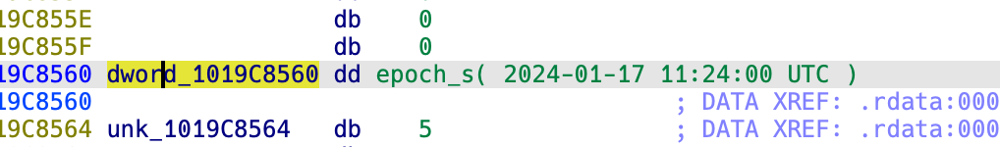

# Unix Time Format Plugin

A powerful IDA Pro plugin that adds custom data format handlers for displaying Unix timestamps in various time units and timezones.

## Features

- **Multiple Time Units**: Format timestamps as seconds, milliseconds, microseconds, or nanoseconds
- **Timezone Support**: Display timestamps in both UTC and local time
- **Easy Application**: Right-click on values in IDA to apply epoch format
- **Automatic Registration**: Formats are automatically registered when IDA opens a database

## Supported Formats

The plugin registers 8 different epoch format handlers:

- `Make epoch s UTC` - Seconds in UTC
- `Make epoch s local` - Seconds in local time
- `Make epoch ms UTC` - Milliseconds in UTC
- `Make epoch ms local` - Milliseconds in local time
- `Make epoch us UTC` - Microseconds in UTC
- `Make epoch us local` - Microseconds in local time
- `Make epoch ns UTC` - Nanoseconds in UTC
- `Make epoch ns local` - Nanoseconds in local time

## Usage

1. Open a binary in IDA Pro
2. Navigate to a value containing a Unix timestamp (typically a 4-byte integer)
3. Right-click on the value and select `Data Format → Make epoch [unit] [timezone]`
4. The timestamp will be displayed as a human-readable date and time

## Example

A value `0x65A7B8D0` (1705516240 in decimal) will be displayed as:
- `epoch_s( 2024-01-17 11:24:00 UTC )` when using UTC seconds format

## Possible Improvements
- Windows FILETIME support
- Additional timestamp formats

## License

MIT
